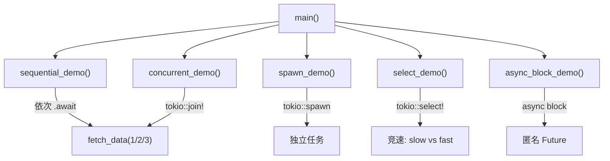
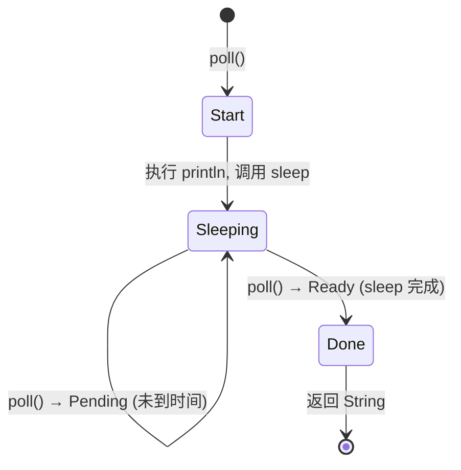
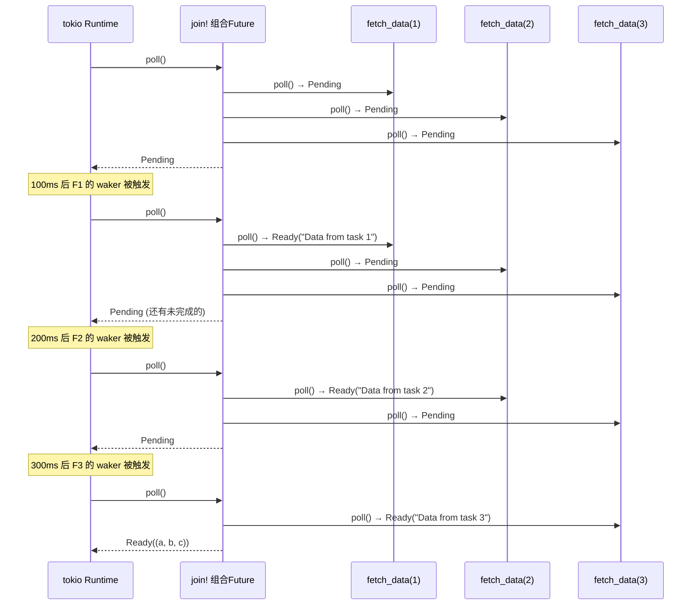
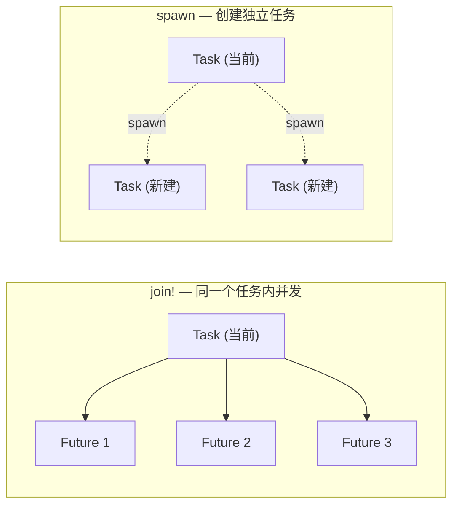
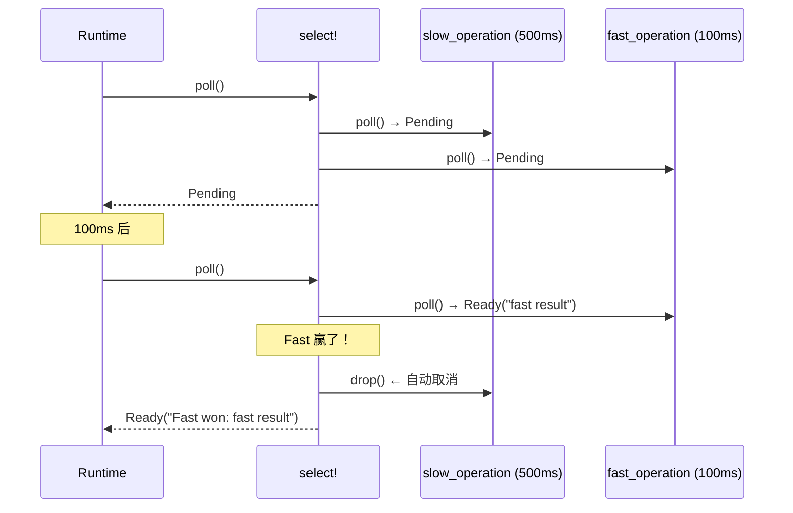
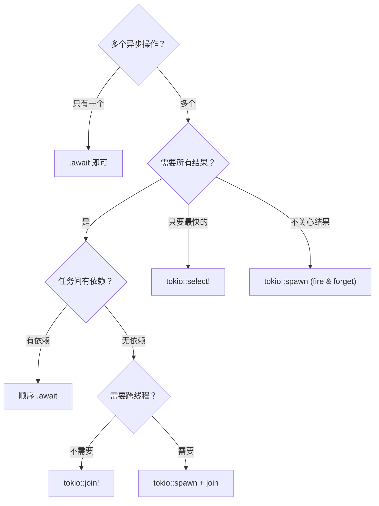

# async_basic.rs 代码分析

> 源文件：`ch1-async-safe/src/async_basic.rs`
>
> 运行方式：`cargo run --bin async_basic`

本文件是 Rust async/await 的入门教程代码，通过 5 个 demo 函数演示了异步编程的核心模式。下面逐一分析。

---

## 整体结构



文件围绕一个核心辅助函数 `fetch_data(id)` 展开，通过不同的调用方式展示 5 种异步模式。

---

## 1. 基础：async fn + .await

### 代码

```rust
async fn fetch_data(id: u32) -> String {
    println!("  [Task {}] Starting fetch...", id);
    sleep(Duration::from_millis(100 * id as u64)).await;
    println!("  [Task {}] Fetch complete!", id);
    format!("Data from task {}", id)
}
```

### 关键点

| 概念 | 说明 |
|------|------|
| `async fn` | 不会立即执行，返回一个 `impl Future<Output = String>` |
| `.await` | 挂起当前任务，将控制权交还给 tokio runtime |
| 惰性求值 | `fetch_data(1)` 只是创建了一个 Future，不 `.await` 就不会运行 |

### 编译器做了什么

`async fn` 会被编译器转换为一个**状态机**：



每次 `.await` 就是一个**让出点（yield point）**，编译器在此处切分状态。

---

## 2. 顺序执行 vs 并发执行

### 2.1 顺序执行 — sequential_demo

```rust
let a = fetch_data(1).await;  // 等 100ms
let b = fetch_data(2).await;  // 再等 200ms
let c = fetch_data(3).await;  // 再等 300ms
// 总计 ≈ 600ms
```

时间线：

```
时间 →  0ms     100ms    300ms    600ms
        |-----1----|
                    |------2------|
                                  |--------3--------|
```

**每个 `.await` 都会阻塞当前 async 函数**，直到 Future 完成后才执行下一行。这和同步代码的行为一致，只是不会阻塞 OS 线程。

### 2.2 并发执行 — concurrent_demo

```rust
let (a, b, c) = tokio::join!(
    fetch_data(1),  // 100ms ┐
    fetch_data(2),  // 200ms ├─ 同时运行
    fetch_data(3),  // 300ms ┘
);
// 总计 ≈ 300ms (取最长的那个)
```

时间线：

```
时间 →  0ms     100ms    200ms    300ms
        |-----1----|
        |--------2--------|
        |-----------3------------|
                                 ↑ 全部完成，join! 返回
```

### join! 的工作原理

`tokio::join!` 是一个宏，它：

1. 将所有 Future 打包成一个**组合 Future**
2. 每次被 poll 时，**轮询所有子 Future**
3. 当**所有**子 Future 都返回 `Ready` 时，组合 Future 才返回 `Ready`



### 顺序 vs 并发对比

| 维度 | 顺序 `.await` | `tokio::join!` |
|------|--------------|----------------|
| 总耗时 | sum(各任务时间) = 600ms | max(各任务时间) = 300ms |
| 执行方式 | 一个完成后才开始下一个 | 所有任务同时推进 |
| 适用场景 | 任务之间有依赖（B 需要 A 的结果） | 任务之间相互独立 |
| 错误处理 | 遇到错误可提前返回 | 等所有完成后统一处理 |

---

## 3. tokio::spawn — 独立任务

### 代码

```rust
async fn spawn_demo() {
    let handle1 = tokio::spawn(async {
        sleep(Duration::from_millis(200)).await;
        42
    });

    let handle2 = tokio::spawn(async {
        sleep(Duration::from_millis(100)).await;
        "hello from task"
    });

    let result1 = handle1.await.unwrap();
    let result2 = handle2.await.unwrap();
}
```

### spawn vs join! 的区别



| 维度 | `tokio::join!` | `tokio::spawn` |
|------|---------------|----------------|
| 任务数量 | 同一个任务内的多个 Future | 创建新的独立任务 |
| 调度 | 在当前任务的 poll 中轮询 | 由 runtime 调度，可能在不同线程 |
| 生命周期 | 与当前 async fn 绑定 | 独立于父任务（父任务结束不影响子任务） |
| 返回值 | 直接返回元组 | 返回 `JoinHandle<T>`，`.await` 得到 `Result<T, JoinError>` |
| `'static` 要求 | 无 | **有**，闭包内不能借用外部非 `'static` 数据 |
| 适用场景 | 结构化并发，等待所有完成 | Fire-and-forget，或需要真正的并行 |

### JoinHandle 与错误处理

```rust
let result1 = handle1.await.unwrap();
//            ^^^^^^^^^^^^^^ → Result<i32, JoinError>
//                           ^^^^^^^^ → 如果 spawned task panic 了，这里会得到 Err
```

`JoinError` 出现在两种情况：
- spawned task **panic** 了
- spawned task 被 **cancel**（handle 被 drop）

---

## 4. tokio::select! — 竞速

### 代码

```rust
async fn select_demo() {
    let winner = tokio::select! {
        val = slow_operation() => { format!("Slow won: {}", val) }
        val = fast_operation() => { format!("Fast won: {}", val) }
    };
    // fast_operation 先完成 → slow_operation 被自动取消
}
```

### 执行流程



### select! 的关键特性

| 特性 | 说明 |
|------|------|
| **取消语义** | 输掉的 Future 被 **drop**，不会继续执行 |
| **公平性** | 默认按代码顺序 poll；加 `biased;` 可保证顺序 |
| **分支守卫** | 可以加 `if condition =>` 条件过滤 |
| **else 分支** | 所有分支都被禁用时执行 |

### 典型应用场景

```rust
// 超时控制
tokio::select! {
    result = do_work() => { /* 正常完成 */ }
    _ = sleep(Duration::from_secs(5)) => { /* 超时了 */ }
}

// 优雅关闭
tokio::select! {
    _ = server.run() => { /* 服务结束 */ }
    _ = shutdown_signal() => { /* 收到关闭信号 */ }
}
```

### ⚠️ 取消安全（Cancellation Safety）

`select!` 会 drop 未完成的 Future，这意味着：

```rust
// ❌ 危险：如果 read 读了一半被取消，数据就丢了
tokio::select! {
    data = socket.read(&mut buf) => { ... }
    _ = timeout => { ... }
}
```

不是所有 Future 都能安全取消。tokio 文档中标注了每个方法是否 **cancellation safe**。

---

## 5. async block — 匿名 Future

### 代码

```rust
async fn async_block_demo() {
    let future = async {
        sleep(Duration::from_millis(50)).await;
        "result from async block"
    };

    // future 还没运行！
    let result = future.await;  // 现在才运行
}
```

### 与 async fn 的对比

| 维度 | `async fn` | `async { ... }` |
|------|-----------|-----------------|
| 定义位置 | 顶层函数 | 任意表达式位置 |
| 命名 | 有函数名 | 匿名 |
| 捕获环境 | 通过参数传入 | 可以捕获外部变量（像闭包） |
| 类型 | `impl Future<Output = T>` | `impl Future<Output = T>` |
| 用途 | 可复用的异步逻辑 | 一次性的内联 Future |

### async block 捕获变量

```rust
let name = String::from("world");

// async block 捕获了 name（move 语义）
let future = async move {
    format!("hello, {}", name)
};
// name 已被 move，这里不能再用

let result = future.await;
```

---

## 运行时行为总览

整个 `main` 函数的执行时间线：

```mermaid
gantt
    title async_basic.rs 执行时间线
    dateFormat X
    axisFormat %Lms

    section sequential_demo
    fetch_data(1) 100ms   :s1, 0, 100
    fetch_data(2) 200ms   :s2, after s1, 200
    fetch_data(3) 300ms   :s3, after s2, 300

    section concurrent_demo
    fetch_data(1) 100ms   :c1, 600, 100
    fetch_data(2) 200ms   :c2, 600, 200
    fetch_data(3) 300ms   :c3, 600, 300

    section spawn_demo
    task1 200ms            :sp1, 900, 200
    task2 100ms            :sp2, 900, 100

    section select_demo
    slow 500ms (cancelled) :crit, se1, 1100, 100
    fast 100ms (winner)    :se2, 1100, 100

    section async_block_demo
    block 50ms             :ab1, 1200, 50
```



## 核心要点总结

```
┌─────────────────────────────────────────────────────────────┐
│                    Rust Async 心智模型                        │
├─────────────────────────────────────────────────────────────┤
│                                                             │
│  async fn / async block                                     │
│      → 创建 Future（惰性，不执行）                            │
│                                                             │
│  .await                                                     │
│      → 驱动 Future 执行，遇到 I/O 时让出控制权                │
│                                                             │
│  tokio::join!(a, b, c)                                      │
│      → 并发运行，等待 ALL 完成                                │
│      → 适合：独立任务，想要所有结果                            │
│                                                             │
│  tokio::select! { a => ..., b => ... }                      │
│      → 并发运行，等待 FIRST 完成，取消其余                    │
│      → 适合：超时、竞速、优雅关闭                             │
│                                                             │
│  tokio::spawn(async { ... })                                │
│      → 创建独立任务（绿色线程）                               │
│      → 适合：fire-and-forget、需要跨线程并行                  │
│                                                             │
└─────────────────────────────────────────────────────────────┘
```

### 选择指南


