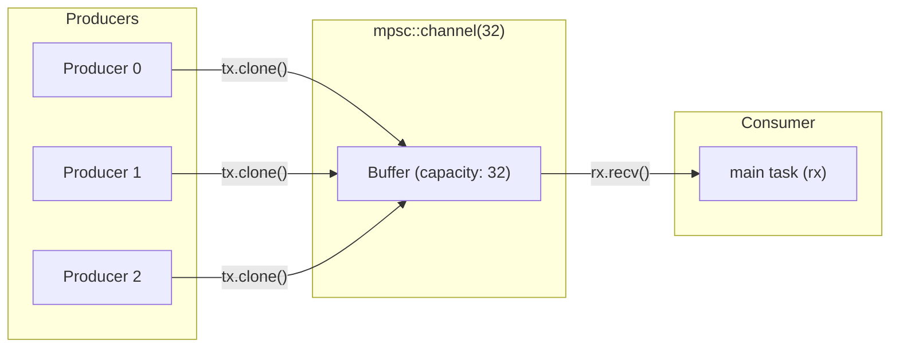
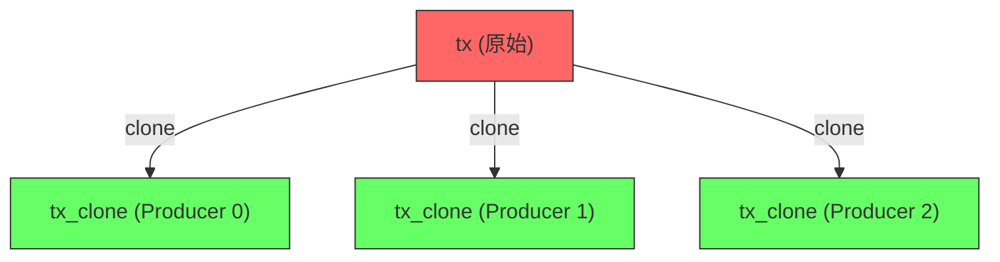
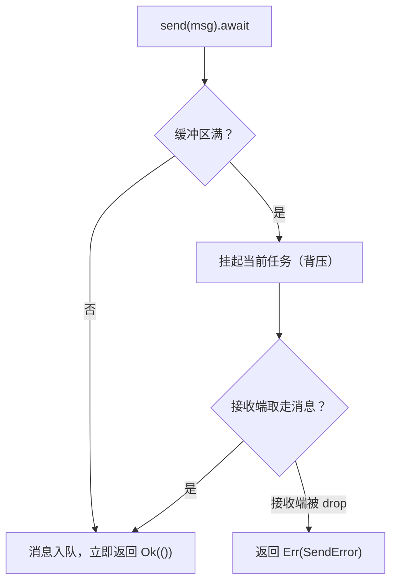
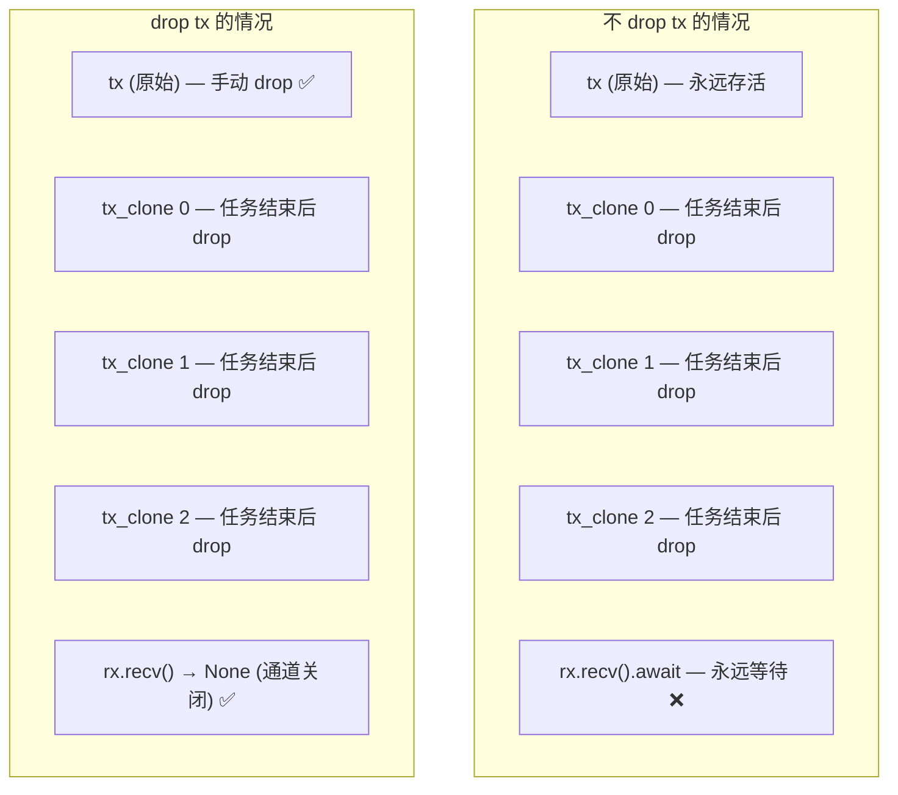
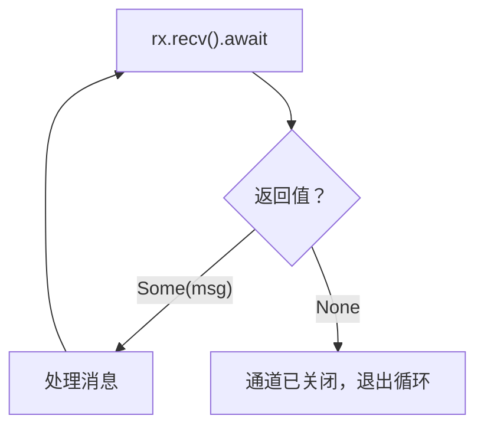
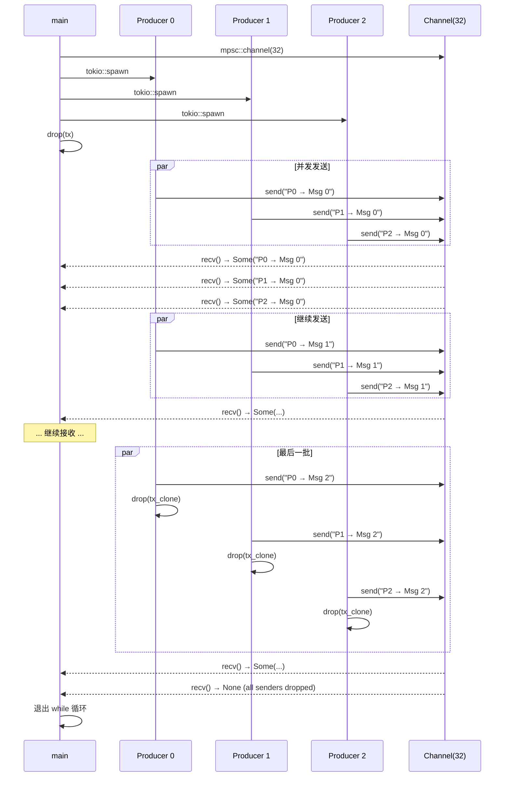
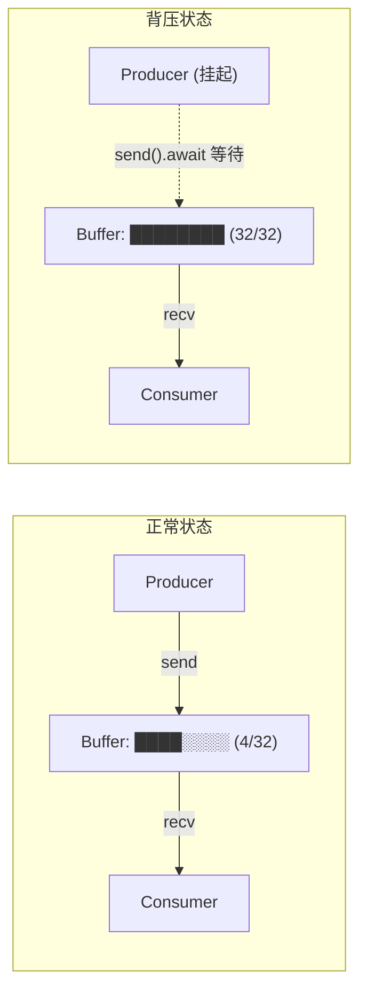

# async_channel.rs 代码分析

> 源文件：`ch1-async-safe/src/async_channel.rs`
>
> 运行方式：`cargo run --bin async_channel`

本文件演示了 Rust 异步编程中最经典的 **生产者-消费者（Producer-Consumer）** 模式，使用 `tokio::sync::mpsc` 有界通道实现。

---

## 整体架构



**MPSC** = **M**ulti-**P**roducer, **S**ingle-**C**onsumer：多个发送者，一个接收者。

---

## 代码逐段分析

### 1. 创建通道

```rust
let (tx, mut rx) = mpsc::channel::<String>(32);
```

| 参数 | 说明 |
|------|------|
| `tx` | 发送端（Sender），可以 `.clone()` 给多个生产者 |
| `rx` | 接收端（Receiver），**只能有一个**（Single-Consumer） |
| `32` | 缓冲区大小，最多暂存 32 条消息 |
| `String` | 通道传输的消息类型 |

#### 有界 vs 无界通道

| 类型 | 创建方式 | 背压 | 内存 |
|------|---------|------|------|
| **有界** `mpsc::channel(N)` | 指定缓冲区大小 | ✅ 缓冲满时 `send().await` 挂起 | 可控 |
| **无界** `mpsc::unbounded_channel()` | 无需指定大小 | ❌ `send()` 永不阻塞 | 可能 OOM |

本文件使用**有界通道**，这是生产环境的推荐做法。

---

### 2. 生产者（Producers）

```rust
for producer_id in 0..3 {
    let tx_clone = tx.clone();

    tokio::spawn(async move {
        for i in 0..3 {
            let msg = format!("Producer {} → Message {}", producer_id, i);
            tx_clone.send(msg).await.unwrap();
            sleep(Duration::from_millis(50)).await;
        }
        println!("  📤 Producer {} done sending", producer_id);
        // tx_clone is dropped here
    });
}
```

#### 关键点解析

**① `tx.clone()` — 多生产者的实现方式**



每个 `clone()` 会增加通道内部的引用计数。只有当**所有** Sender 都被 drop 后，通道才会关闭。

**② `async move` — 所有权转移**

```rust
tokio::spawn(async move {
//                 ^^^^ 将 tx_clone 和 producer_id 移入闭包
```

`tokio::spawn` 要求 `'static` 生命周期，`move` 确保闭包拥有所有捕获变量的所有权。

**③ `tx_clone.send(msg).await` — 异步发送**



- `send()` **转移所有权**：`msg` 被 move 进通道，发送后不能再使用
- 返回 `Result<(), SendError<T>>`：如果接收端已关闭，返回 `Err` 并把消息还给你

**④ 每个 Producer 发送 3 条消息**

```
Producer 0: msg 0, msg 1, msg 2
Producer 1: msg 0, msg 1, msg 2
Producer 2: msg 0, msg 1, msg 2
─────────────────────────────────
Total: 9 messages
```

---

### 3. drop 原始发送端 — 关键步骤

```rust
drop(tx);
```

这一行**至关重要**。原因如下：



| 场景 | 结果 |
|------|------|
| 不 `drop(tx)` | `rx.recv().await` 永远不会返回 `None`，程序**死锁** |
| `drop(tx)` | 3 个 clone 结束后，所有 Sender 都被 drop，通道关闭，`recv()` 返回 `None` |

> **规则**：通道关闭的条件是**所有 Sender 都被 drop**。原始 `tx` 也算一个 Sender。

---

### 4. 消费者（Consumer）

```rust
while let Some(msg) = rx.recv().await {
    println!("  📥 Received: {}", msg);
    received += 1;
}
```

#### `while let Some(msg)` 模式

这是 Rust 中消费通道的惯用写法：



| `recv()` 返回值 | 含义 |
|-----------------|------|
| `Some(msg)` | 收到一条消息 |
| `None` | 所有 Sender 已 drop，通道关闭，不会再有新消息 |

#### 消息顺序

由于 3 个 Producer 是并发运行的（`tokio::spawn`），消息到达的顺序**不确定**。可能的输出：

```
📥 Received: Producer 0 → Message 0
📥 Received: Producer 1 → Message 0
📥 Received: Producer 2 → Message 0
📥 Received: Producer 0 → Message 1
📥 Received: Producer 2 → Message 1
📥 Received: Producer 1 → Message 1
...
```

但**同一个 Producer 内部**的消息顺序是保证的（FIFO）。

---

## 执行时序图



---

## 背压机制（Backpressure）详解

本文件使用 `mpsc::channel(32)`，缓冲区为 32。当生产速度 > 消费速度时：



| 状态 | Producer 行为 | Consumer 行为 |
|------|--------------|--------------|
| 缓冲区未满 | `send()` 立即返回 | `recv()` 立即返回 |
| 缓冲区已满 | `send().await` **挂起**（背压） | `recv()` 立即返回 |
| 缓冲区为空 | `send()` 立即返回 | `recv().await` **挂起** |
| 通道关闭 | `send()` 返回 `Err` | `recv()` 返回 `None` |

背压的好处：**防止生产者无限制地生产消息导致内存溢出**。

---

## 所有权模型

`mpsc` 通道天然利用了 Rust 的所有权系统：

```rust
let msg = format!("Producer {} → Message {}", producer_id, i);
tx_clone.send(msg).await.unwrap();
// msg 已被 move 进通道，这里不能再使用 msg
// println!("{}", msg);  // ❌ 编译错误：value used after move
```


**任何时刻，消息只有一个所有者**，不存在数据竞争的可能。这是 Rust 通道相比其他语言的核心优势。

---

## 与其他通道类型对比

tokio 提供了多种通道，适用于不同场景：

| 通道类型 | 发送者 | 接收者 | 缓冲 | 适用场景 |
|---------|--------|--------|------|---------|
| **`mpsc::channel`** | 多个 | 1 个 | 有界 | ✅ 本文件使用。最常用的生产者-消费者模式 |
| `mpsc::unbounded_channel` | 多个 | 1 个 | 无界 | 消息量可控、不需要背压 |
| `broadcast::channel` | 多个 | 多个 | 有界 | 发布-订阅，每个接收者都能收到所有消息 |
| `watch::channel` | 1 个 | 多个 | 1 | 配置更新、状态广播（只保留最新值） |
| `oneshot::channel` | 1 个 | 1 个 | 1 | 一次性结果传递（如 RPC 响应） |

---

## 常见陷阱

### ❌ 忘记 drop 原始 Sender

```rust
let (tx, mut rx) = mpsc::channel(32);
for _ in 0..3 {
    let tx_clone = tx.clone();
    tokio::spawn(async move { tx_clone.send(...).await; });
}
// 忘记 drop(tx) → 程序永远挂起！
while let Some(msg) = rx.recv().await { ... }
```

### ❌ 在 spawn 外使用 rx

```rust
// ❌ rx 不能 clone，只能有一个消费者
let rx2 = rx.clone(); // 编译错误！Receiver 没有实现 Clone
```

### ❌ send 后继续使用消息

```rust
let msg = String::from("hello");
tx.send(msg).await.unwrap();
println!("{}", msg); // ❌ 编译错误：msg 已被 move
```

---

## 核心要点总结

```
┌─────────────────────────────────────────────────────────────┐
│              mpsc Channel 心智模型                            │
├─────────────────────────────────────────────────────────────┤
│                                                             │
│  mpsc::channel(N)                                           │
│      → 创建有界通道，缓冲区大小 N                             │
│      → 返回 (Sender, Receiver)                              │
│                                                             │
│  tx.clone()                                                 │
│      → 多个 Producer 共享通道（引用计数）                     │
│                                                             │
│  tx.send(msg).await                                         │
│      → 转移 msg 所有权进通道                                 │
│      → 缓冲满时挂起（背压）                                  │
│      → 接收端关闭时返回 Err                                  │
│                                                             │
│  rx.recv().await                                            │
│      → 返回 Some(msg) 或 None（通道关闭）                    │
│      → while let Some(msg) = rx.recv().await 是惯用模式      │
│                                                             │
│  drop(tx)                                                   │
│      → 必须 drop 所有 Sender，通道才会关闭                   │
│      → 忘记 drop 原始 tx = 死锁                             │
│                                                             │
└─────────────────────────────────────────────────────────────┘
```
