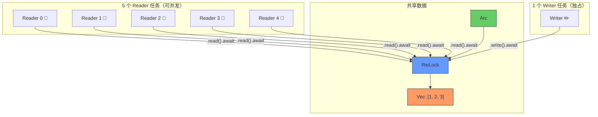
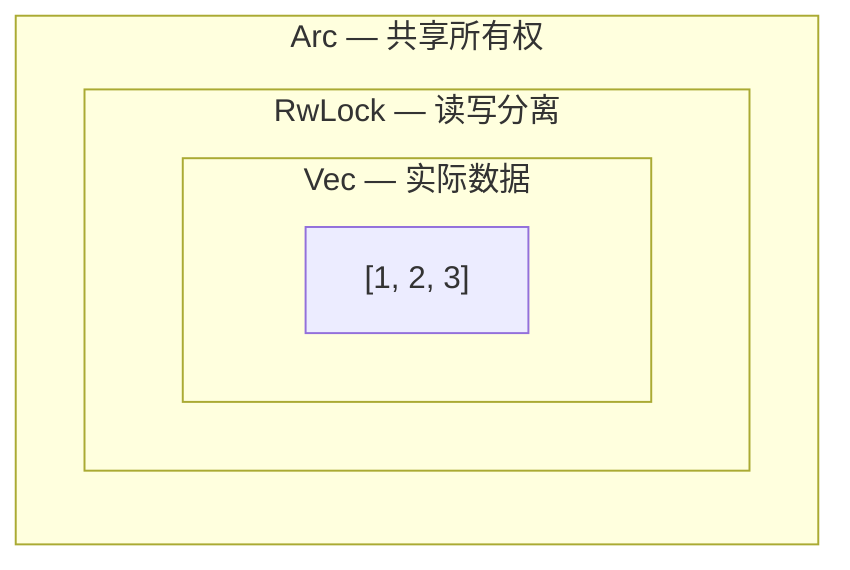
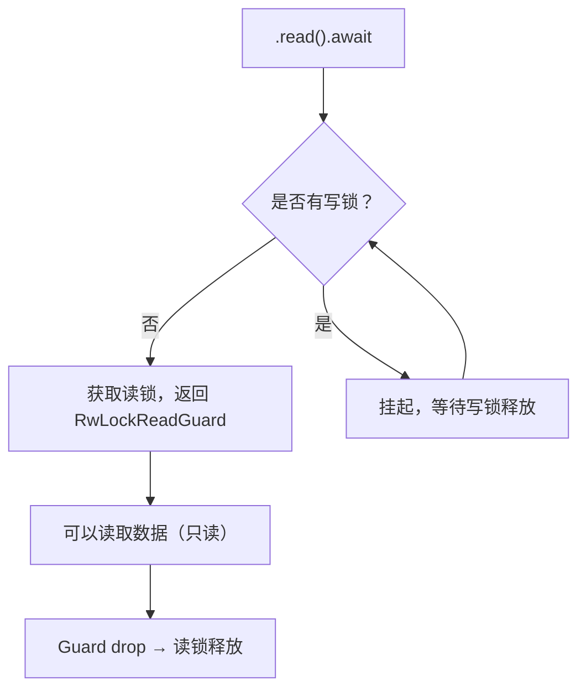
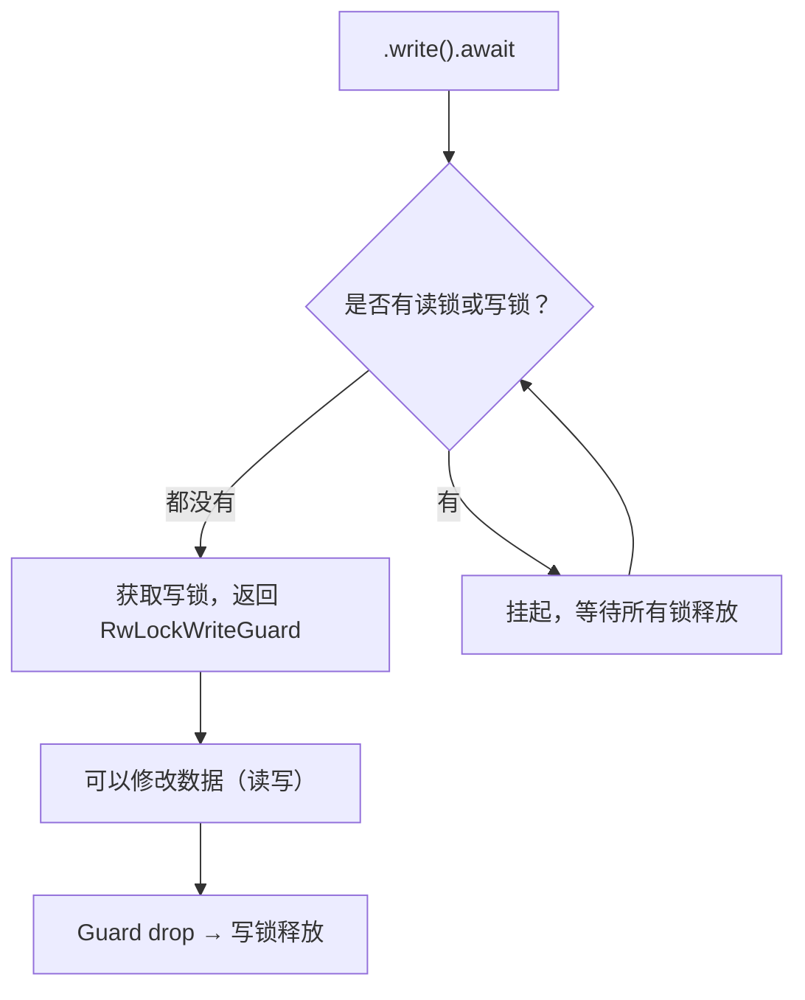
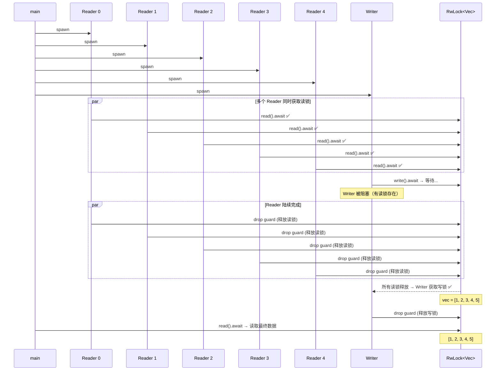
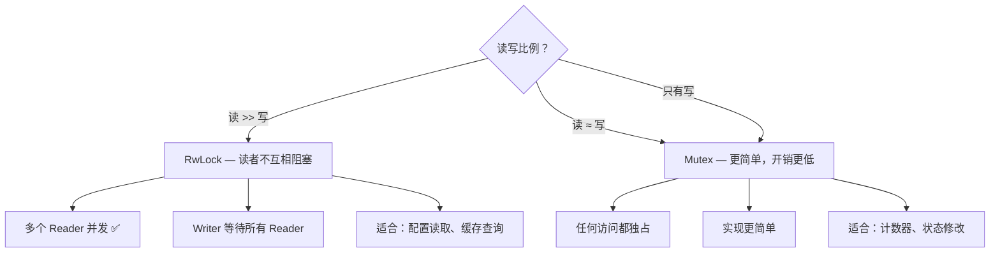

# async_rwlock.rs 代码分析

> 源文件：`ch1-async-safe/src/async_rwlock.rs`
>
> 运行方式：`cargo run --bin async_rwlock`

本文件演示了 `tokio::sync::RwLock`——异步读写锁，允许**多个读者同时读取**或**一个写者独占写入**，适用于读多写少的并发场景。

---

## 整体架构



**核心规则**：多个 Reader **可以同时**持有读锁；Writer **必须独占**，等待所有 Reader 释放后才能获取写锁。

---

## 代码逐段分析

### 1. 创建共享数据

```rust
let data = Arc::new(RwLock::new(vec![1, 2, 3]));
```

与 `Arc<Mutex<T>>` 类似的洋葱模型，但中间层换成了 `RwLock`：



| 层 | 类型 | 作用 |
|----|------|------|
| 外层 | `Arc` | 原子引用计数，允许多任务共享 |
| 中层 | `RwLock` | 读写锁——多读者 OR 一写者 |
| 内层 | `Vec<i32>` | 实际数据 |

---

### 2. Reader 任务（5 个并发）

```rust
for reader_id in 0..5 {
    let data_clone = Arc::clone(&data);
    handles.push(tokio::spawn(async move {
        let guard = data_clone.read().await;
        println!("  📖 Reader {} sees: {:?}", reader_id, *guard);
        sleep(Duration::from_millis(50)).await;
        println!("  📖 Reader {} done", reader_id);
        // RwLockReadGuard dropped here → read lock released
    }));
}
```

#### 关键点解析

**① `.read().await` — 获取共享读锁**



- **多个 Reader 可以同时持有读锁**——这是 RwLock 相比 Mutex 的核心优势
- 返回 `RwLockReadGuard`，只实现了 `Deref`（只读），**不能修改数据**

**② 5 个 Reader 并发执行**

```mermaid
gantt
    title Reader 并发时序
    dateFormat X
    axisFormat %s

    section Reader 0
    read().await + 读取 :0, 50
    section Reader 1
    read().await + 读取 :0, 50
    section Reader 2
    read().await + 读取 :0, 50
    section Reader 3
    read().await + 读取 :0, 50
    section Reader 4
    read().await + 读取 :0, 50
```



所有 Reader **同时**获取读锁，**同时**读取数据——没有互相等待。

---

### 3. Writer 任务（1 个独占）

```rust
let data_clone = Arc::clone(&data);
handles.push(tokio::spawn(async move {
    sleep(Duration::from_millis(10)).await;  // 让 Reader 先启动

    let mut guard = data_clone.write().await;
    guard.push(4);
    guard.push(5);
    println!("\n  ✏️  Writer modified: {:?}", *guard);
    // RwLockWriteGuard dropped here → write lock released
}));
```

#### 关键点解析

**① `.write().await` — 获取独占写锁**



- Writer **必须等待所有 Reader 释放读锁**后才能获取写锁
- 返回 `RwLockWriteGuard`，实现了 `Deref` + `DerefMut`（可读可写）

**② `sleep(10ms)` 的作用**

```rust
sleep(Duration::from_millis(10)).await;  // 让 Reader 先启动
```

这是一个**演示技巧**：让 Reader 先获取读锁，然后 Writer 必须等待。实际生产代码中不需要这样做。

---

### 4. 读写互斥的完整时序



---

## RwLock 的两种 Guard

| Guard 类型 | 获取方式 | 权限 | 并发性 |
|-----------|---------|------|--------|
| `RwLockReadGuard` | `.read().await` | 只读（`Deref`） | 多个 Reader 可同时持有 |
| `RwLockWriteGuard` | `.write().await` | 读写（`Deref` + `DerefMut`） | 独占，与任何其他锁互斥 |

锁的兼容性矩阵：

| | 读锁 | 写锁 |
|---|:---:|:---:|
| **读锁** | ✅ 兼容 | ❌ 互斥 |
| **写锁** | ❌ 互斥 | ❌ 互斥 |

---

## RwLock vs Mutex 对比



| 特性 | `RwLock<T>` | `Mutex<T>` |
|------|-------------|------------|
| 读并发 | ✅ 多个 Reader 同时读 | ❌ 读也需要独占 |
| 写并发 | ❌ 独占 | ❌ 独占 |
| 锁开销 | 稍高（需要维护读者计数） | 较低 |
| 写者饥饿 | ⚠️ 可能（Reader 太多时 Writer 一直等） | 不存在 |
| 适用场景 | 读多写少（如配置、缓存） | 读写均衡（如计数器） |
| 代码复杂度 | 需要区分 read/write | 统一的 lock |

### 写者饥饿问题

```
Reader 0: ──read──────────────────────────
Reader 1:     ──read──────────────────────
Reader 2:         ──read──────────────────
Writer:   ────────────────────wait...──────  ← 永远等不到！
```

如果 Reader 不断到来，Writer 可能永远无法获取写锁。tokio 的 RwLock 实现了**写者优先**策略来缓解这个问题：当 Writer 在等待时，新的 Reader 请求也会被阻塞。

---

## RAII 自动释放

两种 Guard 都遵循 RAII 模式：

```rust
{
    let guard = data.read().await;   // 加读锁
    println!("{:?}", *guard);        // 使用数据
}   // <-- guard 被 drop → 自动释放读锁

{
    let mut guard = data.write().await;  // 加写锁
    guard.push(42);                      // 修改数据
}   // <-- guard 被 drop → 自动释放写锁
```

**永远不需要手动 unlock**——作用域结束时自动释放。

---

## 常见陷阱

### ❌ 读锁内尝试写入

```rust
let guard = data.read().await;
guard.push(42);  // ❌ 编译错误！RwLockReadGuard 没有 DerefMut
```

### ❌ 同一任务中先读后写导致死锁

```rust
let read_guard = data.read().await;
let write_guard = data.write().await;  // ❌ 死锁！读锁还没释放
```

**解决方案**：先 drop 读锁：

```rust
let value = {
    let read_guard = data.read().await;
    read_guard.clone()  // 复制数据
};  // 读锁在这里释放

let mut write_guard = data.write().await;  // ✅ 安全
*write_guard = value + 1;
```

### ❌ 长时间持有读锁

```rust
let guard = data.read().await;
sleep(Duration::from_secs(60)).await;  // ❌ Writer 被阻塞 60 秒！
drop(guard);
```

**规则**：读锁也应尽快释放，否则会饿死 Writer。

### ❌ 在不需要 RwLock 时使用它

```rust
// 如果所有操作都是写入，RwLock 比 Mutex 更慢（额外的读者计数开销）
let counter = Arc::new(RwLock::new(0));  // ❌ 应该用 Mutex
```

---

## 实际应用场景

| 场景 | 为什么用 RwLock |
|------|----------------|
| **配置管理** | 配置被频繁读取，偶尔更新 |
| **缓存系统** | 大量缓存查询，偶尔缓存失效/更新 |
| **路由表** | 请求处理时频繁查询路由，偶尔添加新路由 |
| **用户会话** | 频繁验证会话，偶尔创建/销毁会话 |
| **特性开关** | 每个请求检查开关状态，偶尔修改 |

---

## 核心要点总结

```
┌─────────────────────────────────────────────────────────────┐
│              RwLock 核心要点                                  │
├─────────────────────────────────────────────────────────────┤
│                                                             │
│  RwLock::new(value)                                         │
│      → 创建读写锁保护的数据                                  │
│                                                             │
│  rwlock.read().await                                        │
│      → 获取共享读锁（多个 Reader 可同时持有）                 │
│      → 返回 RwLockReadGuard（只读）                          │
│                                                             │
│  rwlock.write().await                                       │
│      → 获取独占写锁（必须等所有锁释放）                       │
│      → 返回 RwLockWriteGuard（可读可写）                     │
│                                                             │
│  Guard drop → 自动释放锁（RAII）                             │
│                                                             │
│  选择依据：                                                  │
│      读 >> 写 → RwLock                                      │
│      读 ≈ 写  → Mutex                                       │
│      只有写   → Mutex                                       │
│                                                             │
│  注意事项：                                                  │
│      • 不要在同一任务中同时持有读锁和写锁                     │
│      • 读锁也要尽快释放（避免写者饥饿）                       │
│      • 跨 .await 持有锁时必须用 tokio 版本                   │
│                                                             │
└─────────────────────────────────────────────────────────────┘
```
