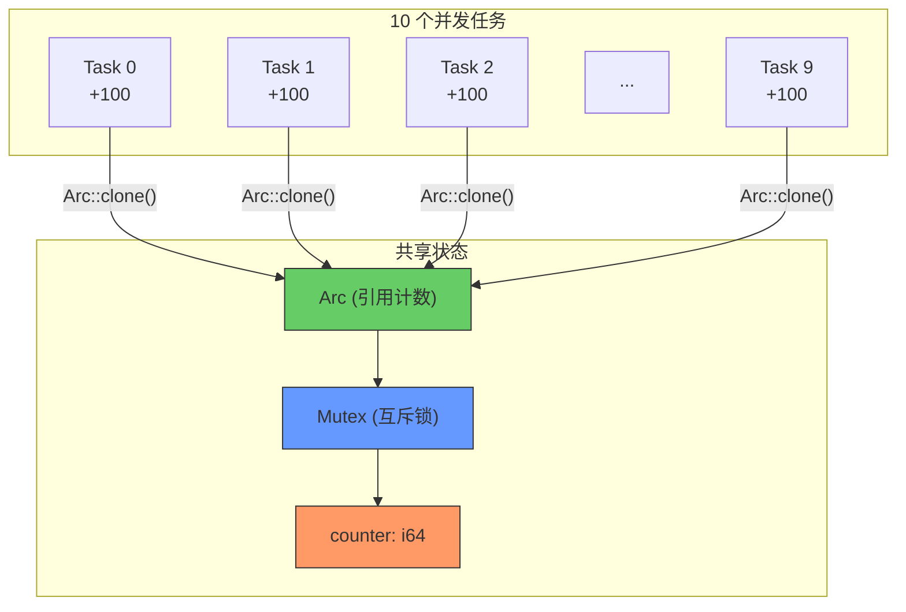
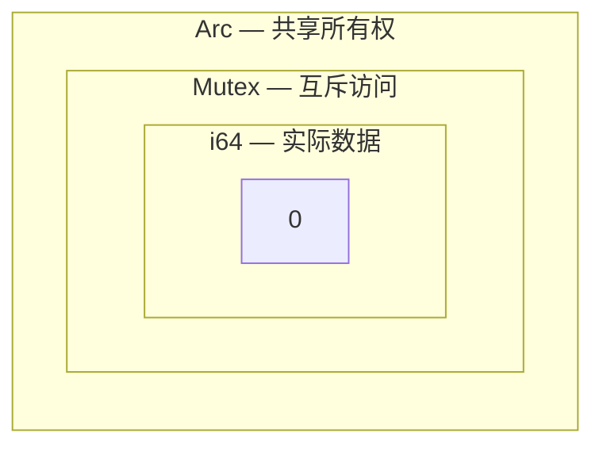
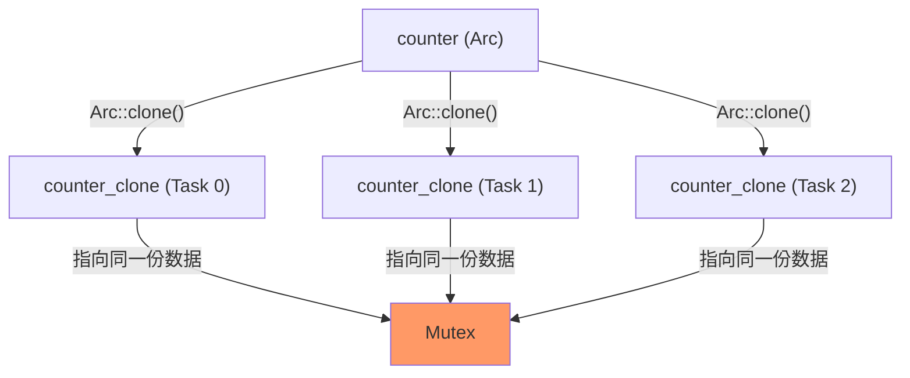
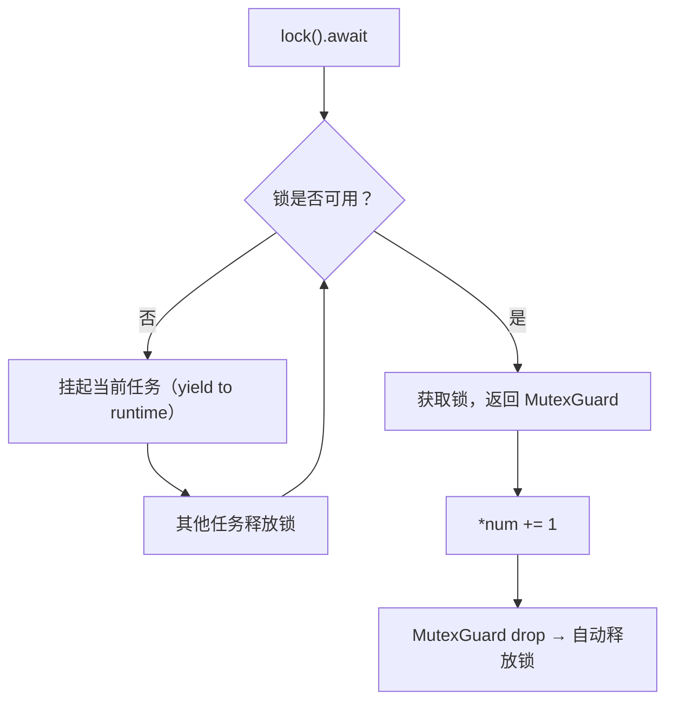
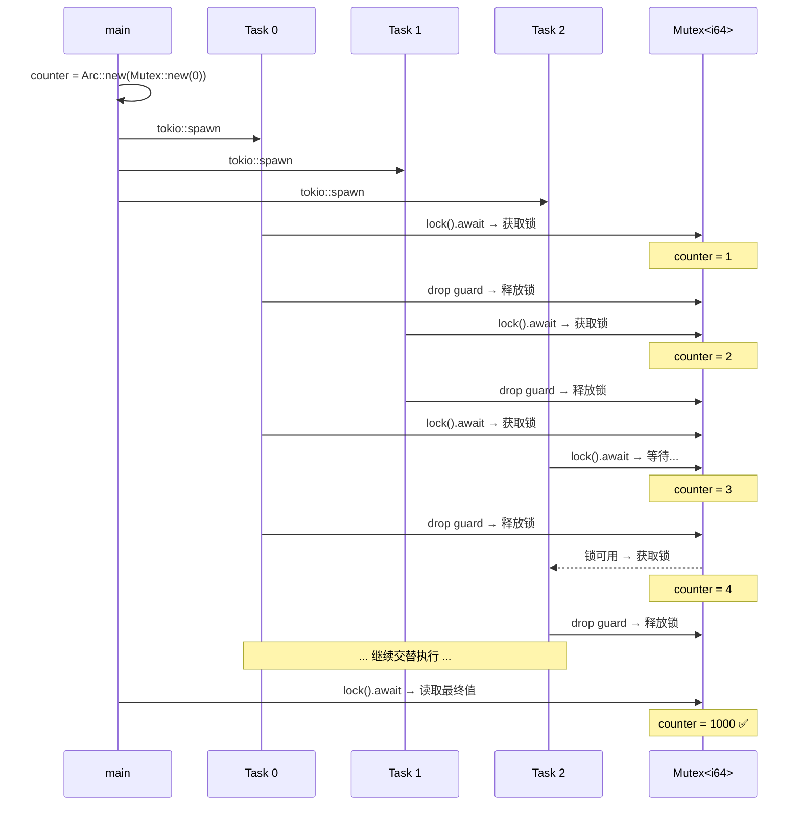
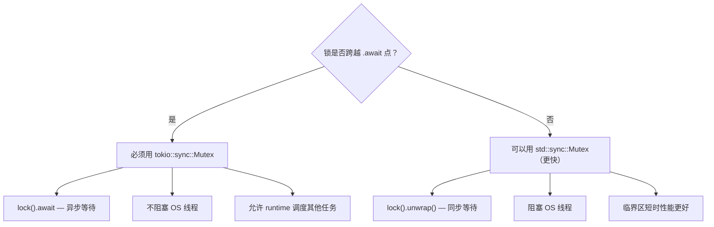

# async_shared_counter.rs 代码分析

> 源文件：`ch1-async-safe/src/async_shared_counter.rs`
>
> 运行方式：`cargo run --bin async_shared_counter`

本文件演示了 Rust 异步编程中**共享可变状态**的标准模式：`Arc<Mutex<T>>`，使用 `tokio::sync::Mutex` 实现无数据竞争的并发计数器。

---

## 整体架构



**10 个任务 × 100 次递增 = 1000**，最终结果保证正确，无数据竞争。

---

## 代码逐段分析

### 1. 创建共享状态

```rust
let counter = Arc::new(Mutex::new(0i64));
```

这是一个**洋葱模型**，从外到内三层：



| 层 | 类型 | 作用 |
|----|------|------|
| 外层 | `Arc` | **A**tomic **R**eference **C**ounting — 允许多个任务共享同一份数据 |
| 中层 | `Mutex` | **互斥锁** — 保证同一时刻只有一个任务能访问数据 |
| 内层 | `i64` | 实际的计数器值 |

#### 为什么需要 Arc？



- `Arc::clone()` **不会复制数据**，只是增加引用计数（原子操作，非常廉价）
- 当最后一个 `Arc` 被 drop 时，数据才会被释放

#### 为什么需要 Mutex？

Rust 的所有权系统禁止多个可变引用同时存在。`Mutex` 提供了**内部可变性（interior mutability）**：

```
没有 Mutex:
  Task 0: counter += 1  ─┐
  Task 1: counter += 1  ─┤── 数据竞争！编译器拒绝 ❌
  Task 2: counter += 1  ─┘

有 Mutex:
  Task 0: lock → counter += 1 → unlock ─┐
  Task 1: (等待)    lock → counter += 1 → unlock ─┤── 安全 ✅
  Task 2: (等待)         (等待)    lock → counter += 1 → unlock ─┘
```

---

### 2. 生成并发任务

```rust
for task_id in 0..10 {
    let counter_clone = Arc::clone(&counter);

    let handle = task::spawn(async move {
        for _ in 0..100 {
            let mut num = counter_clone.lock().await;
            *num += 1;
            // MutexGuard dropped here → lock released
        }
        println!("  Task {} finished (100 increments)", task_id);
    });

    handles.push(handle);
}
```

#### 关键点解析

**① `Arc::clone(&counter)` — 共享所有权**

```rust
let counter_clone = Arc::clone(&counter);
// 等价于 counter.clone()，但 Arc::clone() 更明确表达意图
```

| 操作 | 成本 | 效果 |
|------|------|------|
| `Arc::clone()` | 极低（原子 +1） | 新增一个指向同一数据的指针 |
| `String::clone()` | 高（堆分配+复制） | 创建数据的完整副本 |

**② `async move` — 所有权转移**

```rust
task::spawn(async move {
//                ^^^^ counter_clone 和 task_id 被 move 进闭包
```

`tokio::spawn` 要求 `'static` 生命周期，`move` 确保闭包拥有 `counter_clone` 的所有权。

**③ `counter_clone.lock().await` — 异步加锁**



**④ RAII 自动释放**

```rust
{
    let mut num = counter_clone.lock().await;  // 加锁
    *num += 1;
}   // <-- MutexGuard 在这里被 drop → 自动解锁
```

不需要手动 `unlock()`！这是 Rust RAII 模式的核心优势——**锁的生命周期与 Guard 绑定**。

---

### 3. 等待所有任务完成

```rust
for handle in handles {
    handle.await.unwrap();
}
```

`JoinHandle::await` 等待任务完成，`unwrap()` 处理可能的 panic。

---

### 4. 读取最终结果

```rust
let final_value = *counter.lock().await;
println!("\n  Final counter value: {} (expected: 1000)", final_value);
assert_eq!(final_value, 1000);
```

即使是**读取**也需要 `.lock().await`——Mutex 不区分读写，任何访问都需要获取锁。

> 如果读多写少，应该考虑使用 `RwLock`（见 `async_rwlock.rs`）。

---

## 执行时序图



---

## tokio::sync::Mutex vs std::sync::Mutex

这是一个高频面试题，也是实际开发中的重要选择：



| 特性 | `tokio::sync::Mutex` | `std::sync::Mutex` |
|------|----------------------|---------------------|
| 加锁方式 | `.lock().await`（异步） | `.lock().unwrap()`（同步） |
| 等待时行为 | **yield** 给 runtime | **阻塞** OS 线程 |
| 跨 `.await` 使用 | ✅ 安全 | ❌ 可能死锁 |
| 性能（短临界区） | 稍慢（有 runtime 开销） | 更快 |
| 适用场景 | 锁内有异步操作 | 锁内只有同步操作且很快完成 |

### 跨 `.await` 的危险示例

```rust
// ❌ 使用 std::sync::Mutex 跨 .await — 可能死锁！
let guard = std_mutex.lock().unwrap();
some_async_operation().await;  // 任务被挂起，但锁没释放！
drop(guard);

// ✅ 使用 tokio::sync::Mutex 跨 .await — 安全
let guard = tokio_mutex.lock().await;
some_async_operation().await;  // 安全：tokio 知道锁的状态
drop(guard);
```

---

## Arc<Mutex<T>> 模式详解

这是 Rust 中共享可变状态的**标准模式**：

```
┌─────────────────────────────────────────────────────────────┐
│                Arc<Mutex<T>> 心智模型                        │
├─────────────────────────────────────────────────────────────┤
│                                                             │
│  问题：多个异步任务需要读写同一份数据                         │
│                                                             │
│  解法：                                                     │
│    Arc   → 让多个任务"共享"同一份数据（共享所有权）           │
│    Mutex → 让同一时刻只有一个任务能"修改"数据（互斥访问）     │
│                                                             │
│  类比：                                                     │
│    Arc   = 图书馆的借书卡（多人持有，指向同一本书）           │
│    Mutex = 阅览室的门锁（一次只能进一个人）                   │
│    T     = 书本身                                           │
│                                                             │
│  使用步骤：                                                 │
│    1. let data = Arc::new(Mutex::new(初始值));               │
│    2. let clone = Arc::clone(&data);   // 给每个任务一份     │
│    3. let guard = clone.lock().await;  // 加锁               │
│    4. *guard += 1;                     // 修改数据           │
│    5. // guard drop → 自动解锁                               │
│                                                             │
└─────────────────────────────────────────────────────────────┘
```

---

## 常见陷阱

### ❌ 忘记 drop Guard 导致死锁

```rust
let mut guard = counter.lock().await;
*guard += 1;
// 忘记 drop(guard)，或者 guard 的作用域太大
another_lock.lock().await;  // 如果 another_lock 也需要 counter 的锁 → 死锁！
```

**解决方案**：用 `{}` 限制 guard 的作用域：

```rust
{
    let mut guard = counter.lock().await;
    *guard += 1;
} // guard 在这里被 drop
another_lock.lock().await;  // 安全
```

### ❌ 在 lock 内做耗时操作

```rust
let mut guard = counter.lock().await;
sleep(Duration::from_secs(10)).await;  // ❌ 其他任务全部被阻塞 10 秒！
*guard += 1;
```

**规则**：临界区应尽可能短。

### ❌ 直接使用 Mutex 而不用 Arc

```rust
let counter = Mutex::new(0);
tokio::spawn(async move {
    counter.lock().await;  // ❌ counter 被 move 进第一个任务
});
tokio::spawn(async move {
    counter.lock().await;  // ❌ 编译错误：counter 已被 move
});
```

**必须用 Arc 包裹**才能在多个任务间共享。

---

## 与其他并发原语对比

| 原语 | 适用场景 | 读写模型 |
|------|---------|---------|
| **`Mutex<T>`** | 读写频率相当 | 任何访问都需要独占锁 |
| `RwLock<T>` | 读多写少 | 多个读者 OR 一个写者 |
| `mpsc::channel` | 生产者-消费者 | 通过消息传递数据（无共享状态） |
| `Atomic*` | 简单数值操作 | 无锁原子操作（最快） |
| `watch::channel` | 状态广播 | 一个写者，多个读者（只保留最新值） |

> **本文件使用 `Mutex`**，因为所有任务都需要写入。如果大部分是读操作，应使用 `RwLock`。

---

## 核心要点总结

```
┌─────────────────────────────────────────────────────────────┐
│              Arc<Mutex<T>> 核心要点                          │
├─────────────────────────────────────────────────────────────┤
│                                                             │
│  Arc::new(Mutex::new(value))                                │
│      → 创建可共享的互斥数据                                  │
│                                                             │
│  Arc::clone(&data)                                          │
│      → 廉价克隆（引用计数 +1），给每个任务一份                │
│                                                             │
│  data.lock().await                                          │
│      → 异步获取锁，返回 MutexGuard                          │
│      → 等待时 yield 给 runtime（不阻塞线程）                 │
│                                                             │
│  *guard += 1                                                │
│      → 通过 Guard 修改数据（DerefMut）                       │
│                                                             │
│  drop(guard) / 作用域结束                                    │
│      → 自动释放锁（RAII）                                    │
│                                                             │
│  tokio::sync::Mutex vs std::sync::Mutex                     │
│      → 跨 .await 必须用 tokio 版本                           │
│      → 短临界区可以用 std 版本（更快）                        │
│                                                             │
└─────────────────────────────────────────────────────────────┘
```
