# LLDB 调试 `#[tokio::main]` —— 为什么断点执行顺序"不对"？

## 1. 背景

在调试以下代码时，发现 LLDB 单步执行的顺序与源码书写顺序不一致：

```rust
// main.rs
use std::io::{self, Write};

#[tokio::main]
async fn main() {                          // 第 35 行
    println!("Hello");                     // 第 36 行
                                           // 第 37 行
    loop {                                 // 第 38 行
        print!("> ");                      // 第 39 行
        io::stdout().flush().unwrap();     // 第 40 行

        let mut input = String::new();     // 第 42 行
        io::stdin().read_line(&mut input).unwrap(); // 第 43 行

        tokio::time::sleep(std::time::Duration::from_millis(100)).await;
        println!("Echo: {}", input.trim());
        break;
    }
}
```

**直觉预期**：先执行第 36 行 `println!("Hello")`，再执行第 38 行 `loop`。

**实际观察**：LLDB 先停在第 38 行 `loop`，然后才到第 36 行 `println!`。

---

## 2. 核心原因：宏展开产生了两个函数

`#[tokio::main]` 宏将你的 `async fn main()` 转换为：

```rust
fn main() {                                // ← 宏生成的同步 fn main()
    let rt = tokio::runtime::Runtime::new().unwrap();
    rt.block_on(async {                    // ← 你的 async 代码被包在这里
        println!("Hello");
        loop { ... }
    });
}
```

关键点：**源码中的第 36 行和第 38 行属于两个不同的函数**。

LLDB 设断点时的输出证实了这一点：

```
(lldb) b main.rs:36
Breakpoint: tokio_debug_explore::main::{{closure}}   ← async closure（你的代码）

(lldb) b main.rs:38
Breakpoint: tokio_debug_explore::main               ← 宏生成的 fn main()
```

| 源码行 | 所属函数 | 性质 |
|--------|---------|------|
| 第 38 行 `loop {` | `tokio_debug_explore::main` | 宏生成的 **fn main()**，编译器将调试信息映射到此行 |
| 第 36 行 `println!("Hello")` | `main::{{closure}}` | 你的 **async 代码**，在 runtime 的 poll loop 里执行 |

---

## 3. 完整调试实录

### 3.1 在第 34 行设断点，用 `n` (step over) 单步

```
(lldb) b main.rs:34
(lldb) run
```

#### 步骤 1：停在 `fn main()` 入口

```
* stop reason = breakpoint 1.1
-> 34   #[tokio::main]
   35   async fn main() {
   36       println!("Hello");
```

#### 步骤 2：`n` → 跳到第 38 行 `loop`

```
(lldb) n

-> 38       loop {
   39           print!("> ");
   40           io::stdout().flush().unwrap();
```

> ⚠️ **跳过了第 36 行！** 因为此时还在 `fn main()` 函数内部，编译器把 runtime 创建 + `block_on` 调用的调试信息映射到了 `loop` 这一行。

#### 步骤 3：`n` → 回到第 34 行

```
(lldb) n

-> 34   #[tokio::main]
   35   async fn main() {
   36       println!("Hello");
```

> 这是 `fn main()` 内部的另一步操作（runtime 初始化的一部分）。

#### 步骤 4：`n` → 再次到第 38 行

```
(lldb) n

-> 38       loop {
   39           print!("> ");
```

> 准备调用 `block_on()`。

#### 步骤 5：`n` → 命中第 36 行断点（进入 async closure）

```
(lldb) n

* stop reason = breakpoint 2.1
  frame: main::{{closure}}
-> 36       println!("Hello");  // ← 终于到了你的代码！
```

> 🎯 **此时才真正进入 async closure**，`block_on()` 的 poll loop 开始 poll 你的 Future。

### 3.2 在 async closure 内部逐行调试

从第 36 行开始，在关键行设断点后，可以正常逐行执行：

```
(lldb) b 39
(lldb) n
Hello                          ← println! 输出
-> 39           print!("> ");
```

```
(lldb) n
-> 40           io::stdout().flush().unwrap();
```

```
(lldb) n
> -> 42           let mut input = String::new();
```

```
(lldb) n
-> 43           io::stdin().read_line(&mut input).unwrap();
```

> ✅ 进入 async closure 后，`n` 的行为恢复正常，逐行执行。

---

## 4. 执行流程图

```mermaid
flowchart TD
    subgraph FN_MAIN["fn main() — 宏生成"]
        A["→ 第34行 #[tokio::main]<br/>停在 fn main() 入口"]
        B["→ 第38行 loop {<br/>编译器映射: runtime 创建"]
        C["→ 第34行 #[tokio::main]<br/>runtime 初始化继续"]
        D["→ 第38行 loop {<br/>准备调用 block_on()"]
        E["block_on() 开始执行"]
    end

    subgraph ASYNC_CLOSURE["async closure — 你的代码"]
        F["→ 第36行 println!&#40;'Hello'&#41;"]
        G["→ 第39行 print!&#40;'> '&#41;"]
        H["→ 第40行 io::stdout&#40;&#41;.flush&#40;&#41;"]
        I["→ 第42行 let mut input = String::new&#40;&#41;"]
        J["→ 第43行 io::stdin&#40;&#41;.read_line&#40;&#41;"]
        K["... 正常逐行执行"]
    end

    A -- "n (step over)" --> B
    B -- "n" --> C
    C -- "n" --> D
    D -- "n" --> E
    E -- "进入 async closure<br/>poll Future" --> F
    F -- "n → 输出 Hello" --> G
    G -- "n" --> H
    H -- "n → 输出 >" --> I
    I -- "n" --> J
    J -- "n" --> K

    style FN_MAIN fill:#fff3e0,stroke:#e65100,stroke-width:2px
    style ASYNC_CLOSURE fill:#e8f5e9,stroke:#2e7d32,stroke-width:2px
    style E fill:#ffcc80,stroke:#e65100
    style F fill:#a5d6a7,stroke:#2e7d32
```



---

## 5. 关键结论

### 5.1 为什么 LLDB 先显示 `loop` 再显示 `println!`

- `#[tokio::main]` 宏生成了一个同步的 `fn main()`，你的 async 代码被包在 `block_on(async { ... })` 内
- **编译器把 `fn main()` 的调试行号映射到了源码的第 38 行 `loop {`**
- 所以你看到的"先运行 loop"其实是**先运行宏生成的 fn main()**，不是你的 loop

### 5.2 `n` (step over) 的行为差异

| 阶段 | `n` 的行为 | 原因 |
|------|-----------|------|
| 在 `fn main()` 中 | 跳过 `println!`，在第 34/38 行之间反复 | `block_on()` 是一个函数调用，`n` 会 step over 它 |
| 在 async closure 中 | 正常逐行执行 | 已经在 closure 内部，`n` 按行走 |

### 5.3 调试 `#[tokio::main]` 的最佳实践

**不要在第 34 行 `#[tokio::main]` 设断点然后用 `n`**，而是：

```lldb
# 直接在你关心的 async 代码行设断点
(lldb) b main.rs:36
(lldb) run

# 命中后，n 就能正常逐行走了
-> 36       println!("Hello");
(lldb) n
-> 39       print!("> ");
```

---

## 6. 调用栈对比

### 在 `fn main()` 中（第 38 行）

```
* frame #0: main::h3599a6874fdbbd85 at main.rs:38:5
  frame #1: FnOnce::call_once
  frame #2: std::rt::lang_start
```

### 在 async closure 中（第 36 行）

```
* frame #0: main::{{closure}}::h6ed368f8ac0a2ad3 at main.rs:36:5
  frame #1: CachedParkThread::block_on::{{closure}}
  frame #2: CachedParkThread::block_on
  frame #3: tokio::task::coop::budget
  frame #4: CachedParkThread::block_on
```

> 注意 frame #0 的函数名：`main` vs `main::{{closure}}`，这就是两个不同函数的铁证。
